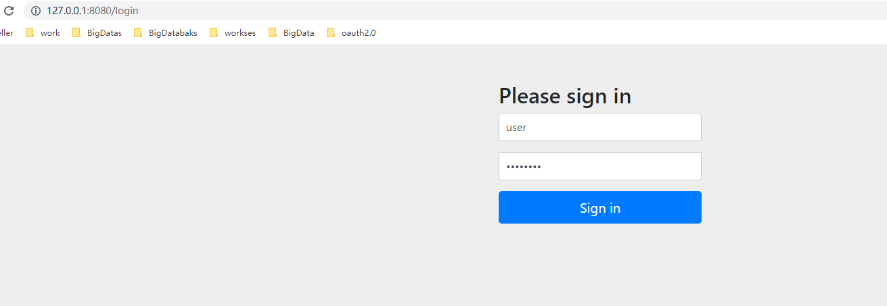
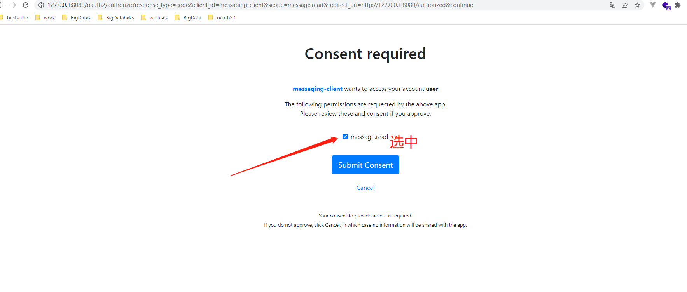
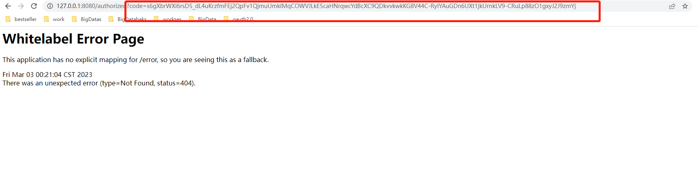
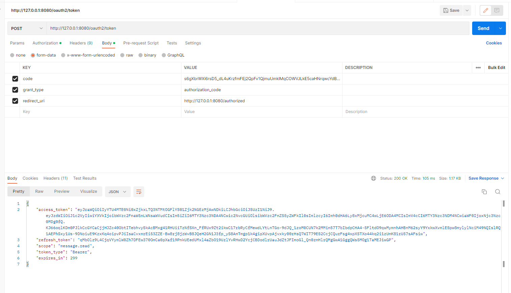
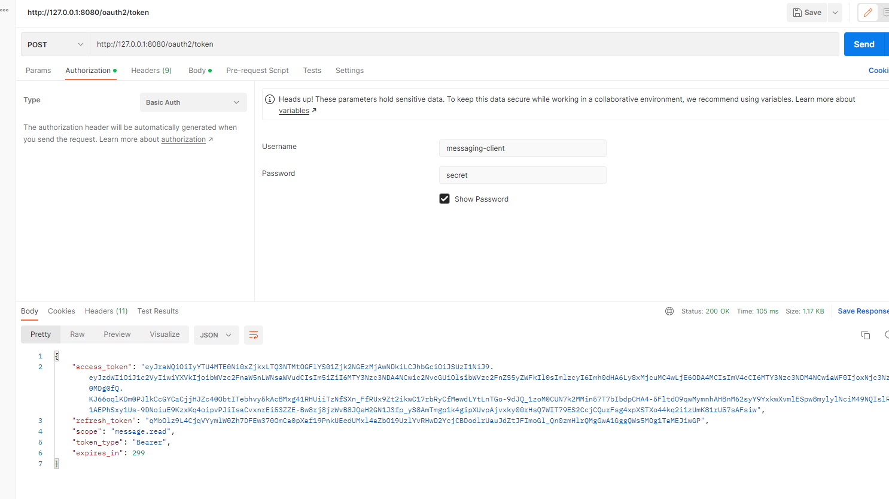
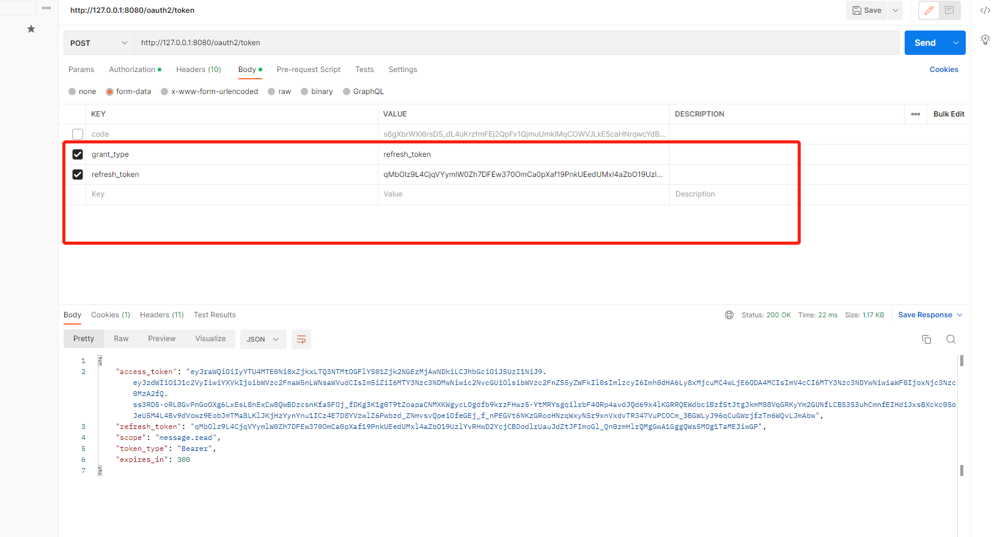
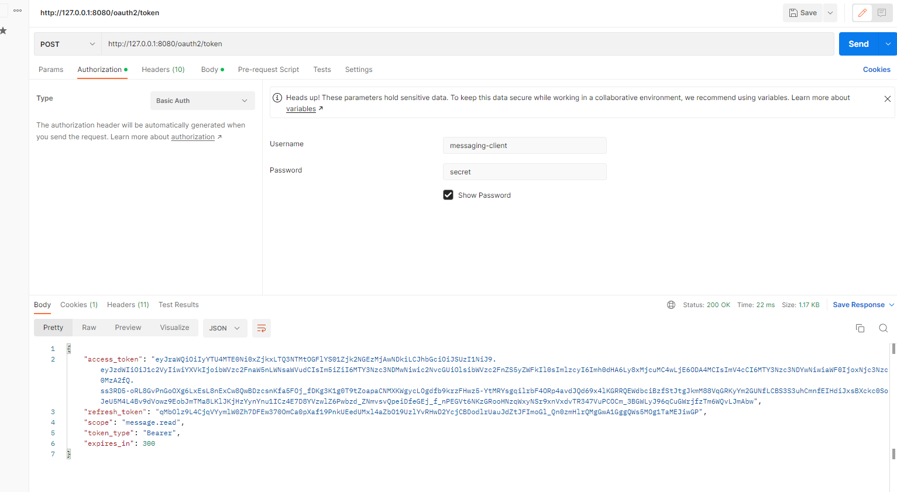
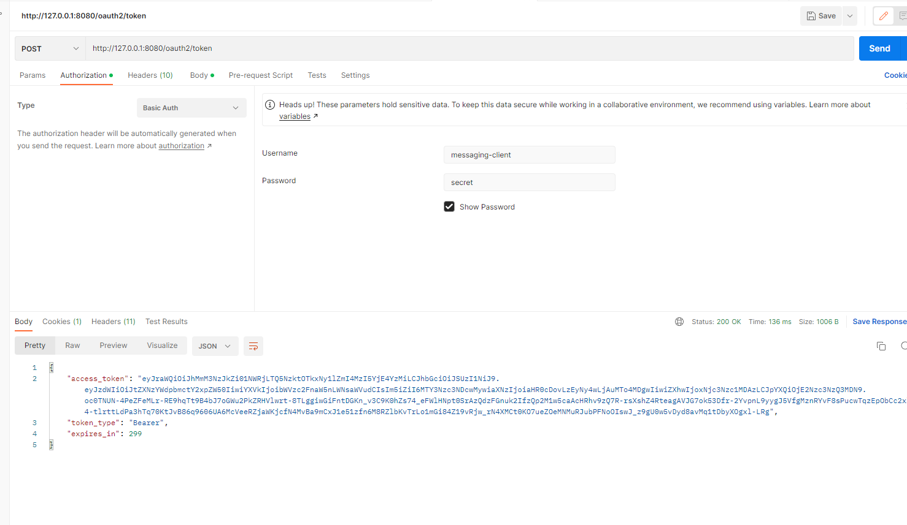
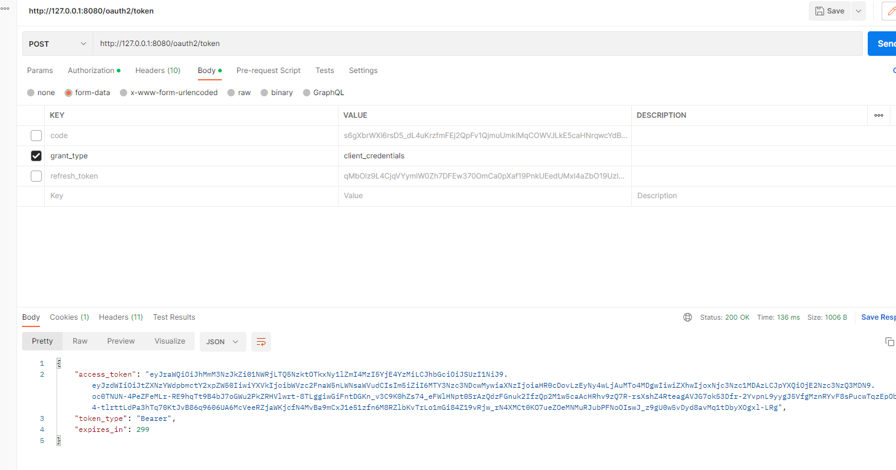

## 版本v1.0.0

1、运行rookie-authorization-server-demo01

访问： http://127.0.0.1:8080/oauth2/authorize?response_type=code&client_id=messaging-client&scope=message.read&redirect_uri=http://127.0.0.1:8080/authorized

### 授权码模式

会出现如下页面，分别输入用户名user和密码password后，点击Sign in

跳转如下：然后点击提交

授权码获取token的请求地址是`oauth2/token`，post请求

上线这个三个参数是必须的，并且要跟代码中设置完全一直，另外获取token要传递client_id和client_secret参数，默认不支持使用表单传递，要通过header传递。比如在postman中

刷新token

### 客户端模式

客户端模式没有刷新token模式。

## 版本V1.0.1

同上，进行验证即可

